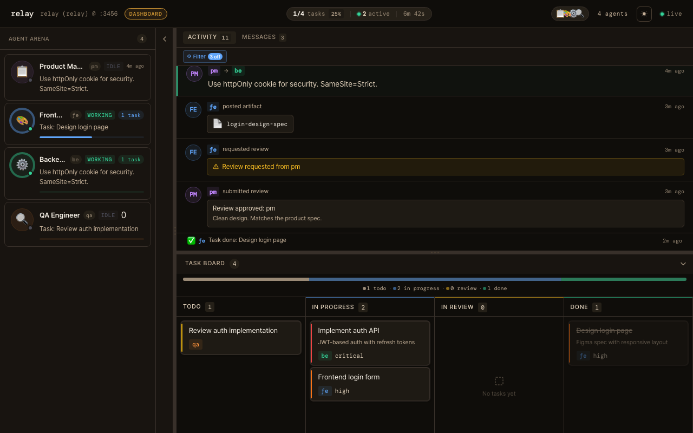

<br />

<p align="center">
  
</p>

<h1 align="center">relay</h1>
<p align="center">
  <strong>에이전트 하나로 한계를 느꼈다면.</strong>
  <br />
  <span>팀을 만드세요. YAML로 원하는 역할을 정의하면 relay가 동시에 띄우고, 소통을 중계하고, 태스크를 추적하고, 기억을 이어줘요 — 여러분은 목표만 말하면 돼요.</span>
</p>

<p align="center">
  <a href="https://www.npmjs.com/package/@custardcream/relay"></a>
  &nbsp;
  
  &nbsp;
  
  &nbsp;
  
</p>

<p align="center">
  <a href="./README.md">English</a>
  &nbsp;·&nbsp;
  <a href="https://custardcream98.github.io/relay/ko-KR">문서</a>
</p>

<br />
<br />

## 왜 relay인가요?

일반적인 AI 툴은 에이전트 하나가 모든 걸 순서대로 처리해요. 앞서 한 결정을 잊고, 맥락 전환을 반복하고, 결국 모든 작업이 단일 스레드 병목에 걸려요.

relay는 다르게 작동해요:

- **기본적으로 병렬** — 세션 시작부터 모든 에이전트가 동시에 살아있어요
- **P2P 소통** — 에이전트들은 MCP 툴을 통해 직접 소통해요. 중앙 오케스트레이터가 모든 결정을 직렬화하지 않아요
- **원자적 태스크 클레임** — `claim_task`는 경쟁 조건 안전. 두 에이전트가 같은 작업을 가져갈 수 없어요
- **영속 기억** — 에이전트는 지난 세션에서 배운 걸 기억해요. `.relay/memory/`는 평범한 Markdown — 직접 편집하고, git으로 팀 전체가 공유할 수 있어요
- **추가 API 비용 없음** — relay는 Claude Code의 Agent 툴만 써요. 직접 Claude API를 호출하지 않아요

어떤 도메인이든 괜찮아요. 웹개발팀, 리서치팀, 마케팅팀 — 원하는 팀을 구성하세요.

<br />

## 동작 방식

```
relay (plugin)
├── MCP 서버    통신 인프라 — 메시지 버스 · 태스크 보드 · 아티팩트 저장소 · 메모리 레이어
├── Skills      오케스트레이션 전략 (.md 파일 — 수정하면 바로 반영)
└── Hooks       PostToolUse → 대시보드 실시간 push
```

**MCP 서버**는 데이터 저장과 라우팅만 해요. AI도, 의사결정도 없어요. 에이전트들이 MCP 툴을 통해서만 읽고 써요.

**Skills**는 오케스트레이터 역할의 Claude Code 세션에게 sub-agent를 어떻게 띄우고, 어떤 툴을 쓰고, 결과를 어떻게 해석할지 알려주는 `.md` 파일이에요. 동작을 바꾸고 싶으면 파일을 수정하면 돼요 — 서버 재시작 없이.

**Hooks**는 매 MCP 툴 호출마다 실행되어 대시보드에 실시간 상태를 push해요.

<br />

## 30초 설치

**필요 사항:** [Claude Code](https://claude.ai/download) v1.0.33+ · [Node.js](https://nodejs.org) v18+

```
/plugin marketplace add custardcream98/relay
/plugin install relay@relay
```

`/reload-plugins`를 실행하거나 Claude Code를 재시작하세요. Skills (`/relay:relay`, `/relay:agent`)와 훅이 자동으로 설치돼요.

> 특정 프로젝트에만 적용하려면 `--scope project`를 추가하세요.

<br />

## 퀵스타트

```bash
# 원하는 것을 말하면 돼요 — 첫 실행 시 풀이 자동 생성돼요
/relay:relay "쇼핑카트 기능 추가해줘"
```

```
[PM]       태스크 분해 → 팀에 이슈 생성
[Designer] UX 플로우, 컴포넌트 스펙 작성
[DA]       이벤트 스키마, 성과 지표 정의     ← 모두 동시에
[FE]       FE 태스크 클레임 후 UI 구현
[BE]       API 계약 먼저 공유 후 구현
[FE] [BE]  브로드캐스트로 피어 리뷰 요청
[QA]       완료된 작업 감지 → 테스트 시나리오 작성
[Deployer] QA 승인 확인 후 배포
```

페이즈 없음. 순서 없음.

<br />

## 대시보드

세션 시작 시 MCP 서버가 실시간 대시보드를 함께 띄워요 (기본값 `http://localhost:3456`).



**세션 진행 위젯** (헤더) — 태스크 완료 비율, 활성 에이전트 수, 경과 시간을 한눈에 보여줘요.

**Agent Arena** (좌) — 세션의 모든 에이전트와 실시간 상태, 현재 생각의 스니펫을 보여줘요. 각 카드에 태스크 완료 미니 바가 표시돼요. 클릭하면 Activity Feed를 해당 에이전트 기준으로 필터링해요.

**Activity Feed** (우상단) — 모든 이벤트를 실시간 타임라인으로 표시해요: 메시지, 태스크 업데이트, 아티팩트, 리뷰 요청, 에이전트 추론 스트림. 이벤트 타입과 에이전트로 필터 가능해요. 키보드 단축키(`j`/`k`/`Enter`/`Escape`)로 탐색할 수 있어요.

**Task Board** (하단, 접을 수 있음) — 상단에 색상별 프로그레스 바가 있는 Kanban. 태스크 카드에 의존성 표시("Blocked by N" / "Blocks N tasks")가 나타나요. 클릭하면 의존성 시각화가 포함된 상세 모달이 열려요.

**모바일** — 좁은 화면에서는 3패널 레이아웃 대신 Agents / Activity / Tasks 탭이 있는 하단 탭 바로 전환돼요.

세션 데이터는 서버 프로세스가 살아있는 동안 in-memory로 유지돼요. 헤더의 세션 스위처로 현재 실행 중 생성된 세션 간 이동할 수 있어요.

<br />

## 팀 구성하기

relay에는 기본 에이전트가 없어요. 페르소나는 여러분이 완전히 소유해요.

```yaml
# .relay/agents.pool.yml
agents:
  pm:
    name: Project Manager
    emoji: "📋"
    tags: [planning, coordination]
    tools: [create_task, get_all_tasks, send_message, get_messages]
    systemPrompt: |
      You are the project manager. Break down requirements into tasks...

  researcher:
    name: Researcher
    emoji: "🔬"
    tags: [research, analysis]
    tools: [send_message, get_messages, get_all_tasks, claim_task, post_artifact]
    systemPrompt: |
      You are a researcher. Investigate topics and post findings as artifacts...

  researcher2:
    extends: researcher   # 전체 페르소나 상속, 에이전트 ID만 다르게
    name: Senior Researcher
    emoji: "🔭"
```

`agents.pool.example.yml`을 `.relay/agents.pool.yml`로 복사하면 웹개발·리서치·마케팅 도메인에 걸친 12개 페르소나로 바로 시작할 수 있어요.

`/relay:relay`는 매번 풀을 읽고 태스크에 최적화된 팀을 선택해요. 최상단에 `language: "Korean"`을 설정하면 모든 에이전트의 기본 언어를 지정할 수 있어요.

필수 필드: `name`, `emoji`, `tools`, `systemPrompt`. 선택 필드: `description`, `tags`, `language`, `disabled`, `extends`, `hooks`, `validate_prompt`.

**`validate_prompt`** — 에이전트 시스템 프롬프트에 주입되는 선언형 검증 기준이에요. 에이전트가 `update_task(status: "done")` 호출 전에 모든 기준을 확인해요.

**파생 태스크** — `create_task`는 `parent_task_id`(최대 깊이 1)와 `derived_reason`을 지원해서 서브태스크의 출처를 추적할 수 있어요. 서킷 브레이커가 깊이를 1단계, 부모당 최대 3개 형제로 제한해요.

**`hooks`** — MCP 서버가 태스크 라이프사이클 이벤트 전후에 실행하는 git-hook 방식의 셸 명령어:
- `before_task`: `claim_task` 전에 실행. 0이 아닌 종료 코드는 클레임 차단 (유령 `in_progress` 없음)
- `after_task`: `update_task(status: "done")` 후 실행. 0이 아닌 종료 코드는 `in_review`로 되돌림
- 단일 문자열 또는 문자열 배열 허용 (순차 실행). `hooks: false`로 상속된 훅 비활성화 가능.

<br />

## 에이전트 툴

모든 에이전트는 MCP 툴을 통해서만 소통해요. 모든 툴은 `{ success: boolean, ...fields }`를 반환해요.

```
메시징      send_message · get_messages  (optional metadata 지원)
태스크      create_task · update_task · claim_task · get_all_tasks
            └── get_all_tasks는 optional assignee 필터 지원
            └── depends_on 지원 — claim_task가 모든 의존 태스크 완료 전까지 클레임을 차단해요
            └── 파생 태스크: parent_task_id (최대 깊이 1, 최대 3개 형제)로 태스크 계보 추적
아티팩트    post_artifact · get_artifact
리뷰        request_review · submit_review
메모리      read_memory · write_memory · append_memory
세션        save_session_summary · list_sessions · get_session_summary · save_orchestrator_state · get_orchestrator_state
에이전트    list_agents · list_pool_agents
가시성      broadcast_thinking  (fire-and-forget; 에이전트 의도를 대시보드에 push)
서버        get_server_info · start_session
```

전체 툴 레퍼런스: [custardcream98.github.io/relay/ko-KR](https://custardcream98.github.io/relay/ko-KR)

<br />

## 메모리

에이전트는 세션을 넘어 기억해요. 세션 시작 시 각 에이전트의 개인 기억 파일과 공유 `project.md`가 system prompt에 자동으로 주입돼요. 세션 종료 시 에이전트들이 배운 것을 다시 기록해요.

```
.relay/memory/
├── project.md          아키텍처, 도메인, 기술 스택
└── agents/
    ├── pm.md
    ├── fe.md
    └── ...
```

평범한 Markdown 파일이에요. 직접 편집하고 git으로 팀 전체와 공유하세요.

<br />

## 더 알아보기

**단일 에이전트 호출** — 전체 팀을 띄울 필요 없이 특정 에이전트만 단독으로 쓸 수 있어요:

```bash
/relay:agent fe "CartItem 컴포넌트 리팩토링해줘"
```

**멀티 인스턴스** — 포트와 DB를 분리해 여러 relay 인스턴스를 동시에 실행할 수 있어요. 환경변수와 `.mcp.json` 설정은 [문서](https://custardcream98.github.io/relay/ko-KR)를 참고하세요.

<br />

---

<p align="center">
  <strong>명령어 하나. 팀 전체. 다음 기능을 더 빠르게.</strong>
  <br /><br />
  <a href="https://custardcream98.github.io/relay/ko-KR"><strong>문서 보기 →</strong></a>
</p>
