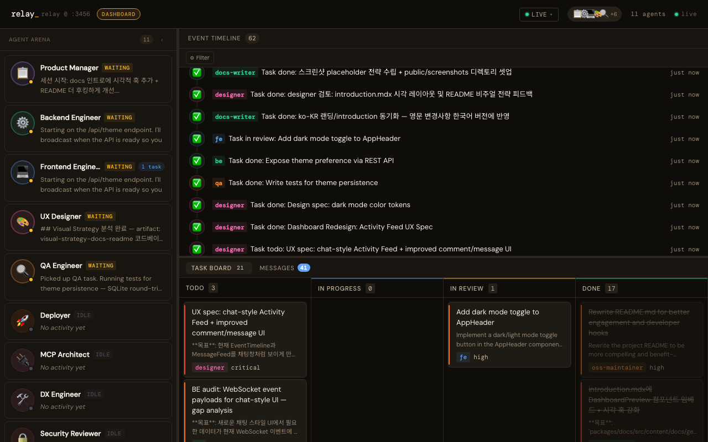

<br />

<p align="center">
  
</p>

<h1 align="center">relay</h1>
<p align="center">
  <strong>Stop prompting one agent. Ship with a whole team.</strong>
  <br />
  <span>Define any team in YAML. relay spawns them all at once, handles all communication, tracks every task, and persists memory across sessions — you just describe the goal.</span>
</p>

<p align="center">
  
  &nbsp;
  
  &nbsp;
  
</p>

<p align="center">
  <a href="./README.ko.md">한국어</a>
  &nbsp;·&nbsp;
  <a href="https://custardcream98.github.io/relay">Docs</a>
</p>

<br />
<br />

## Why relay?

Most AI tooling runs one agent at a time. That agent context-switches constantly, loses track of earlier decisions, and turns every task into a serial bottleneck.

relay works differently:

- **Parallel by default** — all agents are alive from session start, working simultaneously
- **Peer-to-peer** — agents communicate directly through MCP tools; no central orchestrator serializing every decision
- **Atomic task claiming** — `claim_task` is race-condition safe; two agents can never pick up the same work
- **Persistent memory** — agents remember what they learned last session; `.relay/memory/` is plain Markdown, git-trackable and editable by the whole team
- **Zero extra API cost** — relay uses Claude Code's built-in Agent tool exclusively; no direct Claude API calls

Any domain. Define a web-dev team, a research team, a marketing team — whatever fits your work.

<br />

## How it works

```
relay (plugin)
├── MCP Server    message bus · task board · artifact store · memory layer
├── Skills        orchestration strategy (plain .md files — edit to change behavior)
└── Hooks         PostToolUse → real-time dashboard push
```

The **MCP server** stores and routes data only — no AI, no decisions. Agents read from and write to it exclusively through MCP tools.

**Skills** are `.md` files that tell the orchestrating Claude Code session how to spawn agents, which tools to use, and how to interpret results. Change orchestration behavior by editing a file — no restart needed.

**Hooks** fire on every MCP tool call and push live updates to the dashboard.

<br />

## 30-second install

**Prerequisites:** [Claude Code](https://claude.ai/download) v1.0.33+ · [Node.js](https://nodejs.org) v18+

```
/plugin marketplace add custardcream98/relay
/plugin install relay@relay
```

Run `/reload-plugins` or restart Claude Code. Skills (`/relay:relay`, `/relay:agent`) and hooks install automatically.

> Install for a single project only: add `--scope project`.

<br />

## Quick start

```bash
# Describe what you want — pool auto-generates on first run
/relay:relay "add a shopping cart"
```

```
[PM]       breaks down requirements → creates tasks for the team
[Designer] writes UX flow + component spec
[DA]       defines event schema, success metrics     ← all at once
[FE]       claims FE tasks, builds the UI
[BE]       shares API contract early, builds backend
[FE][BE]   request peer reviews via broadcast
[QA]       watches for completed work, writes test scenarios
[Deployer] waits for QA sign-off → ships
```

No phases. No turn-taking.

<br />

## Dashboard

The MCP server starts a live dashboard at session start (default `http://localhost:3456`).



**Session Progress** (header) — task completion ratio, active agent count, and elapsed time at a glance.

**Agent Arena** (left) — all session agents with live status and current thinking. Each card includes a task completion mini-bar. Click any agent to focus the Activity Feed.

**Activity Feed** (top right) — real-time timeline of every event: messages, task updates, artifacts, reviews, and agent thinking streams. Filter by event type or agent. Navigate with keyboard shortcuts (`j`/`k`/`Enter`/`Escape`). Click any artifact card to view its full content.

**Task Board** (bottom, collapsible) — Kanban with a color-coded progress bar at the top. Task cards show dependency indicators ("Blocked by N" / "Blocks N tasks"). Click any task for the detail modal with dependency visualization.

**Mobile** — on narrow screens, a bottom tab bar replaces the three-panel layout with Agents / Activity / Tasks tabs.

<br />

## Configure your team

relay ships with no built-in agents. You own the personas entirely.

```yaml
# .relay/agents.pool.yml
agents:
  pm:
    name: Project Manager
    emoji: "📋"
    tags: [planning, coordination]
    tools: [create_task, get_all_tasks, send_message, get_messages]
    systemPrompt: |
      You are the project manager. Break down requirements into tasks...

  researcher:
    name: Researcher
    emoji: "🔬"
    tags: [research, analysis]
    tools: [send_message, get_messages, get_all_tasks, claim_task, post_artifact]
    systemPrompt: |
      You are a researcher. Investigate topics and post findings as artifacts...

  researcher2:
    extends: researcher   # inherit full persona, different agent ID
    name: Senior Researcher
    emoji: "🔭"
```

Copy `agents.pool.example.yml` — 12 pre-built personas spanning web-dev, research, and marketing — to `.relay/agents.pool.yml` to get started immediately.

`/relay:relay` reads the pool each time and assembles a task-optimized team from it. Set a top-level `language: "Korean"` to default all agents to a specific language.

Required fields: `name`, `emoji`, `tools`, `systemPrompt`. Optional: `description`, `tags`, `language`, `disabled`, `extends`, `hooks`, `validate_prompt`, `review_checklist`.

**`validate_prompt`** — declarative validation criteria injected into the agent's system prompt. Agents check all listed criteria before calling `update_task(status: "done")`.

**`review_checklist`** — structured review criteria for peer reviews. Set at the top level for all agents, or per-agent for role-specific checklists.

**`shared_blocks`** — define reusable text blocks at the top level and reference them as `{{block_name}}` in agent systemPrompts. Eliminates prompt duplication across agents.

**Derived tasks** — `create_task` supports `parent_task_id` (max depth 1) and `derived_reason` to track where sub-tasks came from. A circuit breaker limits depth to 1 level and max 3 siblings per parent.

**`hooks`** — git-hook style shell commands run by the MCP server before/after task lifecycle events:
- `before_task`: runs before `claim_task`; non-zero exit blocks claiming (no phantom `in_progress`)
- `after_task`: runs after `update_task(status: "done")`; non-zero exit reverts to `in_review`
- Accepts a single string or array of strings (run sequentially). `hooks: false` opts out of inherited hooks.

<br />

## Agent tools

Every agent communicates exclusively through MCP tools. Each tool returns `{ success: boolean, ...fields }`.

```
Messaging    send_message · get_messages  (supports optional metadata)
Tasks        create_task · update_task · claim_task · get_all_tasks
             └── get_all_tasks supports optional assignee filter
             └── Tasks support depends_on — claim_task blocks until all dependencies are done
             └── Derived tasks: parent_task_id (max depth 1, max 3 siblings) tracks task ancestry
Artifacts    post_artifact · get_artifact
Reviews      request_review · submit_review
Memory       read_memory · write_memory · append_memory
Sessions     save_session_summary · list_sessions · get_session_summary · save_orchestrator_state · get_orchestrator_state
Agents       list_agents · list_pool_agents
Visibility   broadcast_thinking  (fire-and-forget; pushes agent intent to the dashboard)
Server       get_server_info · start_session
```

Full tool reference: [custardcream98.github.io/relay](https://custardcream98.github.io/relay)

<br />

## Memory

Agents remember across sessions. At session start, each agent receives its personal memory file plus the shared `project.md` injected into its system prompt. At session end, agents write back what they learned.

```
.relay/memory/
├── project.md          architecture, domain, tech stack
└── agents/
    ├── pm.md
    ├── fe.md
    └── ...
```

Plain Markdown. Edit directly, commit to git, share with the whole team.

<br />

## More

**Single agent** — no need to spin up the full team for focused work:

```bash
/relay:agent fe "Refactor the CartItem component"
```

**Multiple instances** — run several relay instances simultaneously on separate ports with isolated databases. See the [docs](https://custardcream98.github.io/relay) for environment variables and `.mcp.json` config.

<br />

---

<p align="center">
  <strong>One command. A full team. Your next feature ships faster.</strong>
  <br /><br />
  <a href="https://custardcream98.github.io/relay"><strong>Read the docs →</strong></a>
</p>
